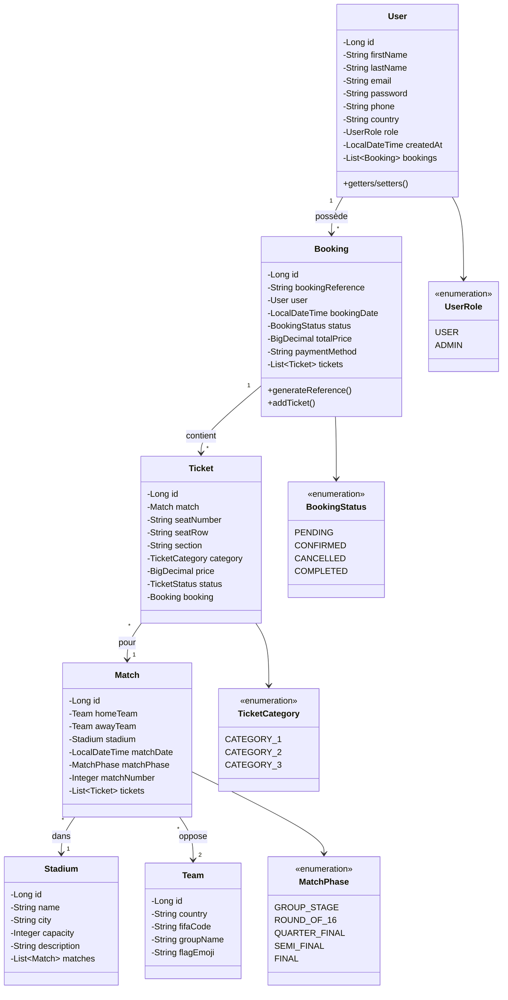
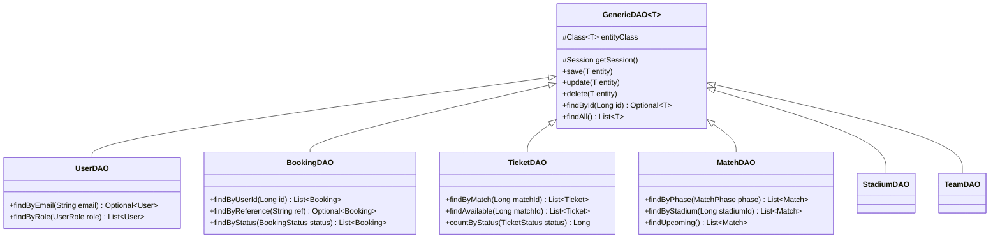

# 🏆 World Cup 2030 Morocco - Ticket System

> **Système de Billetterie pour la Coupe du Monde 2030**  
> Projet Java Avancé - Application Web Full Stack


---

## 📋 Table des Matières

- [Description](#-description)
- [Fonctionnalités](#-fonctionnalités)
- [Architecture](#-architecture)
- [Technologies & Concepts](#-technologies--concepts)
- [Diagramme de Classes](#-diagramme-de-classes)
- [Structure du Projet](#-structure-du-projet)
- [Installation](#-installation)
- [Utilisation](#-utilisation)
- [API REST](#-api-rest)
- [Auteur](#-auteur)

---

## 📖 Description

Cette application est un système complet de gestion de billetterie pour la Coupe du Monde 2030 qui sera organisée au Maroc. Elle permet aux utilisateurs de :

- Consulter les matchs et les stades
- Réserver des billets pour les matchs
- Gérer leurs réservations
- Accéder à un tableau de bord administrateur

Le projet met en œuvre les concepts clés de **Java Avancé** : Hibernate ORM, pattern DAO, API REST, et architecture en couches.

---

## ✨ Fonctionnalités

### 👤 Utilisateur
- Inscription et connexion
- Consultation des matchs par phase (Groupes, Huitièmes, Quarts, etc.)
- Réservation de billets avec choix de catégorie
- Suivi des réservations personnelles
- Annulation de réservations

### 🔑 Administrateur
- Tableau de bord avec statistiques
- Gestion des utilisateurs
- Gestion des réservations
- Suivi des ventes et revenus

---

## 🏗️ Architecture

L'application suit une **architecture en couches** (Layered Architecture) :

```
┌─────────────────────────────────────────────────────┐
│                   PRÉSENTATION                       │
│            (HTML/CSS/JavaScript Frontend)            │
├─────────────────────────────────────────────────────┤
│                    API REST                          │
│              (Java HTTP Server + JSON)               │
├─────────────────────────────────────────────────────┤
│                   SERVICES                           │
│                (Logique Métier)                      │
├─────────────────────────────────────────────────────┤
│                      DAO                             │
│           (Data Access Objects - CRUD)               │
├─────────────────────────────────────────────────────┤
│                   HIBERNATE                          │
│                  (ORM / JPA)                         │
├─────────────────────────────────────────────────────┤
│                    MySQL                             │
│              (Base de données)                       │
└─────────────────────────────────────────────────────┘
```

---

## 🛠️ Technologies & Concepts

### Backend Java

| Concept | Description | Implémentation |
|---------|-------------|----------------|
| **Hibernate ORM** | Mapping Objet-Relationnel | Annotations JPA sur les entités |
| **Pattern DAO** | Accès aux données | Classes DAO avec GenericDAO |
| **API REST** | Interface HTTP | Java HttpServer + Gson |
| **Singleton** | Instance unique | HibernateUtil.getSessionFactory() |
| **Énumérations** | Types constants | UserRole, BookingStatus, MatchPhase |

### Annotations Hibernate Utilisées

```java
@Entity          // Déclare une classe comme entité JPA
@Table           // Configure le nom de la table
@Id              // Définit la clé primaire
@GeneratedValue  // Auto-incrémentation
@Column          // Configuration des colonnes
@ManyToOne       // Relation plusieurs-à-un
@OneToMany       // Relation un-à-plusieurs
@Enumerated      // Persistance des énumérations
@Temporal        // Gestion des dates
```

### Frontend

| Technologie | Utilisation |
|-------------|-------------|
| **HTML5/CSS3** | Structure et style |
| **JavaScript ES6+** | Logique et appels API |
| **Fetch API** | Communication REST |
| **LocalStorage** | Authentification utilisateur |

### Infrastructure

| Outil | Rôle |
|-------|------|
| **Docker** | Conteneurisation MySQL |
| **Maven** | Gestion des dépendances |
| **MySQL 8.0** | Base de données relationnelle |

---

## 📊 Diagramme de Classes



### Diagramme DAO



---

## 📁 Structure du Projet

```
worldcup2030-tickets/
├── 📁 src/main/java/com/worldcup2030/
│   ├── 📁 entity/                    # Entités JPA
│   │   ├── User.java                 # Utilisateur
│   │   ├── Booking.java              # Réservation
│   │   ├── Ticket.java               # Billet
│   │   ├── Match.java                # Match
│   │   ├── Team.java                 # Équipe
│   │   └── Stadium.java              # Stade
│   │
│   ├── 📁 dao/                       # Data Access Objects
│   │   ├── GenericDAO.java           # DAO générique (CRUD)
│   │   ├── UserDAO.java
│   │   ├── BookingDAO.java
│   │   ├── TicketDAO.java
│   │   ├── MatchDAO.java
│   │   ├── TeamDAO.java
│   │   └── StadiumDAO.java
│   │
│   ├── 📁 service/                   # Services métier
│   │   └── DataInitializerService.java
│   │
│   ├── 📁 api/                       # API REST
│   │   ├── ApiHandler.java           # Handler de base
│   │   ├── UserApi.java              # /api/users
│   │   ├── BookingApi.java           # /api/bookings
│   │   ├── TicketApi.java            # /api/tickets
│   │   ├── MatchApi.java             # /api/matches
│   │   ├── TeamApi.java              # /api/teams
│   │   ├── StadiumApi.java           # /api/stadiums
│   │   └── AuthApi.java              # /api/auth
│   │
│   ├── 📁 util/                      # Utilitaires
│   │   └── HibernateUtil.java        # Configuration Hibernate
│   │
│   └── WebServer.java                # Point d'entrée
│
├── 📁 src/main/resources/
│   ├── 📁 static/                    # Frontend
│   │   ├── index.html
│   │   ├── app.js
│   │   ├── api.js
│   │   └── styles.css
│   └── hibernate.cfg.xml             # Config Hibernate
│
├── docker-compose.yml                # MySQL Docker
├── init-db.sql                       # Script d'initialisation
├── pom.xml                           # Dépendances Maven
└── README.md
```

---

## 🚀 Installation

### Prérequis

- Java 17 ou supérieur
- Maven 3.6+
- Docker & Docker Compose

### Étapes

1. **Cloner le projet**
```bash
cd /path/to/project
```

2. **Démarrer MySQL avec Docker**
```bash
docker-compose up -d
```

3. **Compiler et lancer l'application**
```bash
mvn clean compile exec:java -Dexec.mainClass=com.worldcup2030.WebServer
```

4. **Accéder à l'application**
```
http://localhost:8080
```

---

## 📱 Utilisation

### Comptes par défaut

| Rôle | Email | Mot de passe |
|------|-------|--------------|
| Admin | admin@worldcup2030.com | admin123 |
| User | demo@worldcup2030.com | demo123 |

### Workflow de réservation

1. Se connecter avec un compte utilisateur
2. Aller dans la section "Tickets"
3. Sélectionner un match
4. Choisir les billets (catégorie 1, 2 ou 3)
5. Procéder au paiement
6. Consulter la réservation dans "My Bookings"

---

## 🔌 API REST

### Endpoints principaux

| Méthode | Endpoint | Description |
|---------|----------|-------------|
| `POST` | `/api/auth/login` | Connexion |
| `POST` | `/api/auth/register` | Inscription |
| `GET` | `/api/matches` | Liste des matchs |
| `GET` | `/api/stadiums` | Liste des stades |
| `GET` | `/api/teams` | Liste des équipes |
| `GET` | `/api/tickets/match/{id}` | Billets d'un match |
| `POST` | `/api/bookings` | Créer une réservation |
| `GET` | `/api/bookings/user/{id}` | Réservations d'un utilisateur |
| `DELETE` | `/api/bookings/{id}` | Annuler une réservation |
| `GET` | `/api/users` | Liste des utilisateurs (admin) |

### Exemple de requête

```bash
# Créer une réservation
curl -X POST http://localhost:8080/api/bookings \
  -H "Content-Type: application/json" \
  -d '{"userId": 1, "ticketIds": [1, 2, 3]}'
```

---

## 👨‍💻 Auteur

**Abderrahman Ait Karim**  
Projet Java Avancé - 2025/2026

---

## 📄 Licence

Ce projet est développé dans un cadre éducatif.
